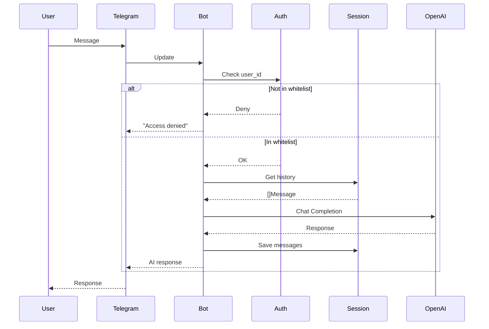

# TgBot - Telegram AI Assistant

## Overview

Telegram bot on Go providing access to AI via OpenAI-compatible API. Initially supports GPT-5, architecture allows easy addition of other providers.

## Key Decisions

| Decision | Choice | Rationale |
|----------|--------|-----------|
| Language | Go | Simple deployment (single binary), good performance, excellent libraries |
| Telegram SDK | go-telegram-bot-api/v5 | Mature, actively maintained library |
| OpenAI SDK | sashabaranov/go-openai | Full API support, including streaming |
| Authorization | Whitelist by user_id | Simple, reliable, no database required |
| Conversation context | In-memory | Sufficient for MVP, easy to replace with persistent storage |
| Configuration | Env vars | Container standard, secrets security |

## Architecture

```
┌─────────────┐     ┌─────────────┐     ┌─────────────┐
│   Telegram  │────▶│   TgBot     │────▶│  OpenAI API │
│   User      │◀────│   (Go)      │◀────│             │
└─────────────┘     └─────────────┘     └─────────────┘
                           │
                    ┌──────┴──────┐
                    │             │
              ┌─────▼─────┐ ┌─────▼─────┐
              │ Whitelist │ │  Session  │
              │   Auth    │ │  Manager  │
              └───────────┘ └───────────┘
```

### Message Processing Flow



## Project Structure

```
TgBot/
├── cmd/
│   └── bot/
│       └── main.go              # Entry point, component initialization
├── internal/
│   ├── config/
│   │   └── config.go            # Configuration loading from env
│   ├── bot/
│   │   └── bot.go               # Telegram handlers, command routing
│   ├── ai/
│   │   ├── provider.go          # AI provider interface
│   │   └── openai.go            # OpenAI implementation
│   ├── session/
│   │   └── session.go           # In-memory conversation context storage
│   ├── auth/
│   │   └── whitelist.go         # Access control by user_id
│   ├── logger/
│   │   └── logger.go            # Logging abstraction (slog implementation)
│   └── version/
│       └── version.go           # Build version info (git commit, date)
├── scripts/
│   ├── build.ps1                # Build for current platform with version
│   ├── build-linux.ps1          # Cross-compile for Linux with version
│   ├── deploy.ps1               # Deploy binary to VPS
│   └── docker-push.ps1          # Build and push Docker image
├── .env.example                 # Configuration example
├── Dockerfile                   # Multi-stage build
├── docker-compose.yml           # For local development
├── README.md                    # Brief description
├── ARCHITECTURE.md              # This file
└── DEPLOYMENT.md                # Build and deployment guide
```

## Modules

### `internal/config`

Loads configuration from environment variables:
- `TELEGRAM_BOT_TOKEN` - bot token from @BotFather
- `OPENAI_API_KEY` - OpenAI API key
- `OPENAI_MODEL` - model (default: gpt-4o)
- `OPENAI_BASE_URL` - API base URL (for compatible providers)
- `ALLOWED_USERS` - comma-separated list of allowed user_id
- `MAX_HISTORY` - max messages in context (default: 20)

### `internal/auth`

Whitelist authorization:
- Parses user_id list at startup
- Method `IsAllowed(userID int64) bool`
- Logs unauthorized access attempts

### `internal/session`

Conversation context management:
- Stores history by user_id in `map[int64][]Message`
- Thread-safe via `sync.RWMutex`
- Methods: `Get`, `Add`, `Clear`
- Automatic history depth limiting

### `internal/ai`

Provider interface and OpenAI implementation:

```go
type Provider interface {
    Complete(ctx context.Context, messages []Message) (string, error)
    ModelName() string
}
```

Allows easy addition of Claude, Gemini, etc.

### `internal/logger`

Logging abstraction with slog implementation:

```go
type Logger interface {
    Debug(msg string, args ...any)
    Info(msg string, args ...any)
    Warn(msg string, args ...any)
    Error(msg string, args ...any)
    With(args ...any) Logger
}
```

Features:
- Swappable implementation (slog, zerolog, zap, logrus)
- Configurable level and format (text/JSON)
- Context propagation via `With()`
- Global and per-component loggers

Configuration:
- `LOG_LEVEL` - debug, info, warn, error (default: info)
- `LOG_FORMAT` - text, json (default: text)

### `internal/version`

Build-time version information injected via ldflags:

```go
var (
    GitCommit = "unknown"  // git rev-parse HEAD
    GitDate   = "unknown"  // git log -1 --format=%ci
    GitBranch = "unknown"  // git rev-parse --abbrev-ref HEAD
    BuildDate = "unknown"  // build timestamp
)
```

Logged at startup:
```
level=INFO msg="starting TgBot" git_commit=abc123 git_date="2026-02-04" git_branch=main ...
```

### `internal/bot`

Telegram bot handlers:
- `/start` - welcome message
- `/new` - clear conversation context
- `/model` - current model
- `/help` - help
- Text messages → AI request

## Dependencies

```go
require (
    github.com/go-telegram-bot-api/telegram-bot-api/v5 v5.5.1
    github.com/sashabaranov/go-openai v1.35.7
    github.com/joho/godotenv v1.5.1
)
```

## Quick Start

```bash
# Install dependencies
go mod download

# Create .env from example
cp .env.example .env
# Edit .env with your tokens

# Run
go run ./cmd/bot
```

For detailed build and deployment instructions, see **[DEPLOYMENT.md](DEPLOYMENT.md)**.

## Extension

### Adding New AI Provider

1. Create file `internal/ai/newprovider.go`
2. Implement `Provider` interface:

```go
type MyProvider struct {
    client *myclient.Client
    model  string
}

func (p *MyProvider) Complete(ctx context.Context, messages []session.Message) (string, error) {
    // Convert messages and call API
}

func (p *MyProvider) ModelName() string {
    return p.model
}
```

3. Add configuration to `internal/config/config.go`
4. Register in `cmd/bot/main.go`

### Persistent Sessions

Replace in-memory `session.Manager` with DB implementation:

```go
type DBManager struct {
    db *sql.DB
}

func (m *DBManager) Get(userID int64) []Message {
    // SELECT from database
}

func (m *DBManager) Add(userID int64, messages ...Message) {
    // INSERT into database
}
```

Options:
- SQLite for simplicity
- PostgreSQL for scaling
- Redis for performance

## Security

- Tokens stored only in env vars, never in code
- `.env` added to `.gitignore`
- Whitelist prevents unauthorized access
- Access attempt logging for audit
- Service runs as dedicated user (non-root)

## Coding Conventions

| Rule | Description |
|------|-------------|
| Indentation | 4 spaces, no tabs |
| Language | All comments and messages in code in English |
| README.md | Always present in project root |
| Structure | Standard Go layout (cmd/, internal/) |
| Secrets | Only via env vars, never hardcoded |
| Thread safety | Mutex for shared state |
| AI providers | Implement `ai.Provider` interface |
